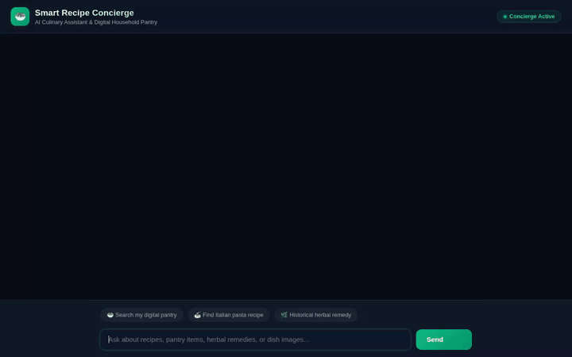
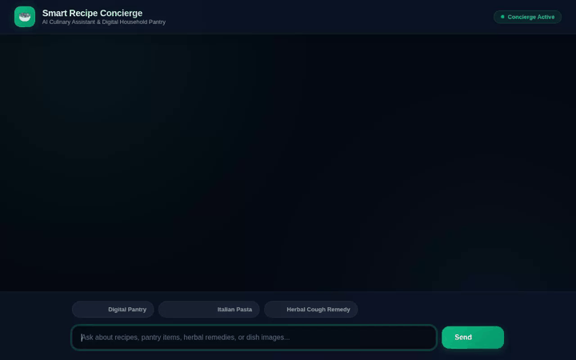
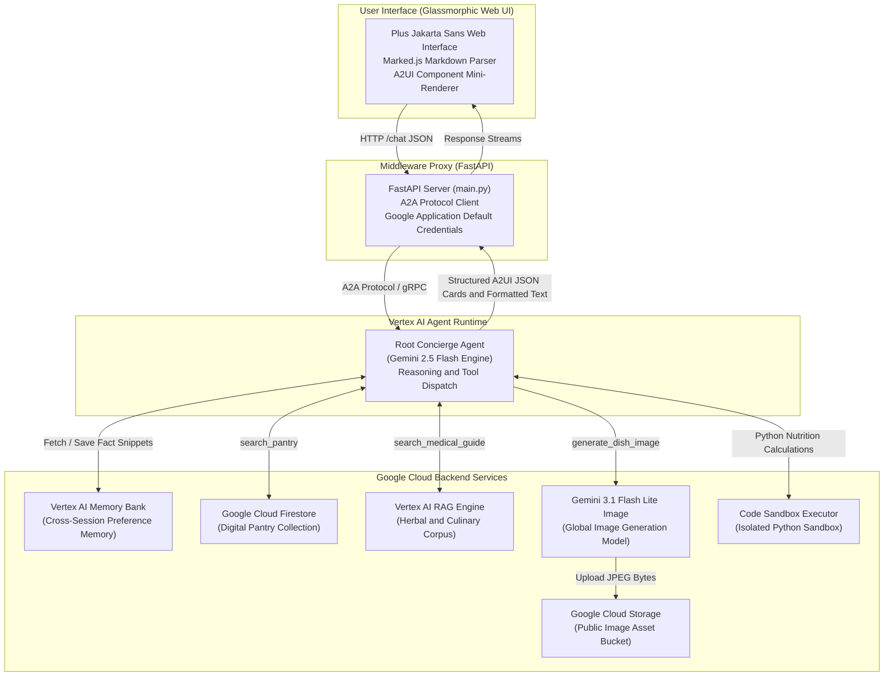

# Smart Recipe Concierge

> **The AI-Powered Culinary Assistant and Digital Household Pantry**  
> *Built with Google Agent Development Kit (ADK), Gemini 2.5 Flash, Firestore, Cloud Storage, Vertex AI Memory Bank, RAG Engine, and A2UI.*

---

## Product Launch Demo


*Watch the Smart Recipe Concierge in action: searching the digital household pantry in Firestore, retrieving grounded historical remedy wisdom via Vertex AI RAG Engine, and rendering rich A2UI recipe cards with AI-generated dish photography.*

---

## Feature Launch Breakdown

### 1. Digital Household Pantry Management
Queries the live Google Cloud Firestore `pantry_inventory` database to retrieve available ingredients, quantities, and expiration dates.



---

### 2. Grounded Historical Remedy Search (RAG Engine)
Performs semantic vector search over an indexed historical culinary and herbal reference guide via Vertex AI RAG Engine.



---

### 3. Generative Dish Photography and Cloud Storage Upload
Generates high-resolution food photos on demand using `gemini-3.1-flash-lite-image`, uploads JPEG assets directly to a public Google Cloud Storage bucket, and renders rich A2UI cards.


---

## Product Overview

**Smart Recipe Concierge** is a state-of-the-art agentic application designed to transform home cooking, meal planning, and digital kitchen inventory management. Built on Google Cloud's Agent Development Kit (ADK) and deployed to **Vertex AI Agent Runtime**, the agent goes far beyond basic chatbots by combining persistent database management, cross-session memory, grounded document retrieval, generative dish visualization, server-side code execution, and structured A2UI card rendering.

---

## Verified Capabilities and Feature Matrix

Every capability listed below is fully implemented, wired, and verified in the codebase:

| Capability | Google Cloud Service / Tech Stack | Implementation Detail in Codebase |
| :--- | :--- | :--- |
| **Cross-Session Memory** | **Vertex AI Memory Bank** | `PreloadMemoryTool` and `add_session_to_memory` callback in `app/agent.py` automatically store and retrieve user dietary preferences across sessions. |
| **Digital Pantry Management** | **Google Cloud Firestore** | `search_pantry` tool queries the `pantry_inventory` NoSQL collection to list active ingredients, quantities, and expiration dates. |
| **Persistent Media Storage** | **Google Cloud Storage (GCS)** | Dedicated public GCS bucket hosts uploaded recipe photography and generated dish assets with public HTTPS URLs. |
| **Grounded Knowledge RAG** | **Vertex AI RAG Engine** | `search_medical_guide` function tool performs semantic vector search over an indexed historical culinary and herbal reference manual. |
| **Generative Dish Imagery** | **`gemini-3.1-flash-lite-image`** | `generate_dish_image` function tool generates 1024x1024 dish photos, saves them as Playground artifacts, and uploads JPEG bytes to GCS. |
| **Server-Side Code Execution** | **Agent Engine Code Sandbox** | `AgentEngineSandboxCodeExecutor` enables safe Python code execution in an isolated container sandbox for recipe nutrition math. |
| **Rich Component Cards** | **A2UI Agent SDK (v0.8)** | `a2ui-agent-sdk` integration with `BasicCatalog` emits declarative JSON components (`Card`, `Column`, `Row`, `Text`, `Image`, `Icon`). |
| **Custom Web Frontend** | **FastAPI + A2A Protocol** | Same-origin FastAPI proxy (`frontend/main.py`) forwards chat turns via `a2a-sdk` to Agent Runtime, serving a glassmorphic dark-mode UI with Marked.js parsing. |

---

## Technical Architecture and Data Flow



---

## Local Setup and Running Instructions

### Prerequisites
- Python 3.10+
- Google Cloud SDK (`gcloud`) authenticated with a project
- Node.js 18+ (for Playwright recording tools)

### 1. Environment Setup

Clone the repository and install dependencies using `uv`:

```bash
cd smart-recipe-concierge
uv sync
```

Set required environment variables:

```bash
export GOOGLE_CLOUD_PROJECT="<your-gcp-project-id>"
export GOOGLE_CLOUD_LOCATION="us-east1"
```

### 2. Run Agent Locally in ADK Playground

Start the local Agent Development Kit playground:

```bash
agents-cli playground
```

Access the playground UI in your browser at the local port printed by `agents-cli`.

### 3. Run Custom FastAPI Web Frontend

Navigate to the `frontend` directory, set the deployed agent resource name, and launch the proxy:

```bash
cd frontend
export AGENT_ENGINE_RESOURCE_NAME="projects/<project-number>/locations/us-east1/reasoningEngines/<agent-id>"
export AGENT_DIRECTORY="app"
uv run python main.py
```

Open your browser to the local server port (default `8080`) to interact with the full A2A interface.

---

## Recording Feature Demos

To record individual Playwright screen recordings of the agent features:

```bash
# 1. Full Multi-Turn Demo
NODE_PATH=./node_modules node .agents/skills/record-demo/record-agent.js \
  -q "Inspect my digital pantry and list ingredients" \
  -q "Consult the herbal guide for a natural cough remedy" \
  -q "Find an authentic Italian pasta recipe and show image" \
  --wait 30000 \
  -o agent_demo.webm

# 2. Pantry Search Demo
NODE_PATH=./node_modules node .agents/skills/record-demo/record-agent.js \
  -q "Inspect my digital pantry and list ingredients" \
  --wait 15000 \
  -o pantry_demo.webm

# 3. RAG Engine Herbal Remedy Demo
NODE_PATH=./node_modules node .agents/skills/record-demo/record-agent.js \
  -q "Consult the medical guide for a natural herbal cough remedy" \
  --wait 15000 \
  -o rag_demo.webm

# 4. Image Generation and Cloud Storage Demo
NODE_PATH=./node_modules node .agents/skills/record-demo/record-agent.js \
  -q "Generate a vibrant dish photo of an authentic Italian pasta recipe" \
  --wait 30000 \
  -o image_demo.webm
```

---

## Project Structure

```
smart-recipe-concierge/
├── app/
│   ├── agent.py               # Root ADK agent, tools, callbacks, and sandbox executor
│   ├── a2ui_utils.py          # A2UI response rewrapping callback utilities
│   └── __init__.py
├── frontend/
│   ├── main.py                # FastAPI proxy server using a2a-sdk
│   ├── requirements.txt       # Frontend dependencies
│   └── static/
│       └── index.html         # Custom glassmorphic web UI with Marked.js and A2UI renderer
├── agents-cli-manifest.yaml   # Agents CLI deployment configuration
├── pyproject.toml             # Python package definition and dependencies
├── demo.gif                   # Full application launch demo GIF
├── pantry_demo.gif            # Digital Pantry Search feature demo GIF
├── rag_demo.gif               # Grounded RAG Search feature demo GIF
├── image_demo.gif             # Generative Dish Photography feature demo GIF
└── README.md                  # Project documentation and launch guide
```

---

*Developed for the Google Cloud Gemini World Tour Workshop.*
